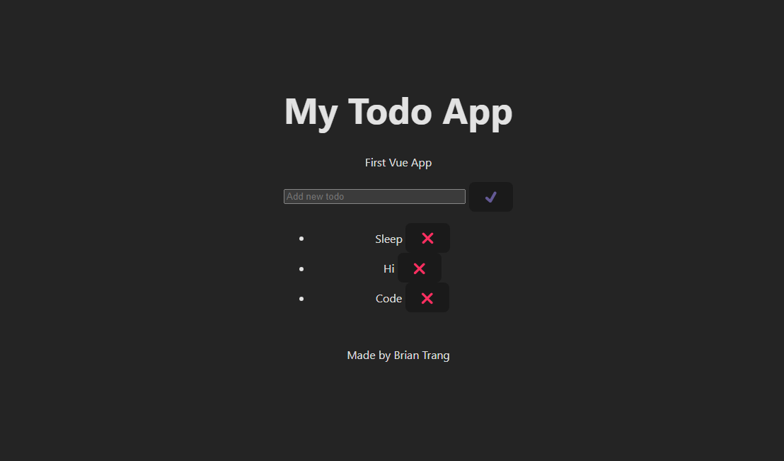
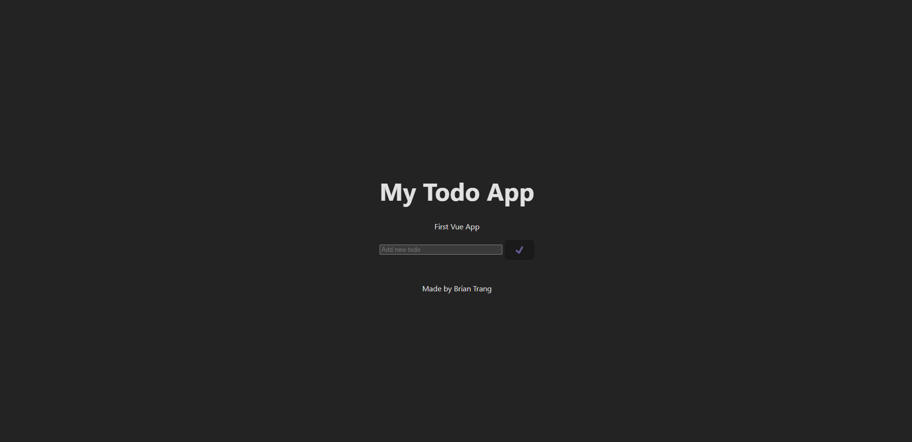

# Todo App -Vue


## 📄 Description 

Basic Todo App

This basic Todo App is crafted with Vue.js, Vite for rapid development, and TypeScript for improved code organization and clarity. Together, these technologies converge to deliver an efficient and user-centric experience.

Equipped with local storage integration, the app retains your tasks between sessions, ensuring no task is lost. Its drag-and-drop functionality streamlines task management, offering a hassle-free experience.

## 🪛 Technologies used 
<p><a href="https://nodejs.org/">Node.js</a></p>
<p><a href="https://www.npmjs.com/">NPM</a></p>
<p><a href="https://nodejs.org/">Node.js</a></p>
<p><a href="https://www.npmjs.com/">NPM</a></p>
<p><a href="https://www.typescriptlang.org/">TypeScript</a></p>
<p><a href="https://vitejs.dev/">Vite</a></p>
<p><a href="https://vuejs.org/">Vue</a></p>
  
## 📓 Table of Contents
- [Todo App -Vue](#todo-app--vue)
  - [📄 Description](#-description)
  - [🪛 Technologies used](#-technologies-used)
  - [📓 Table of Contents](#-table-of-contents)
  - [🖥️ Installation](#️-installation)
  - [💬 Usage](#-usage)
  - [� Video](#-video)
  - [⚖️ License](#️-license)
  - [🤝 Contributing](#-contributing)
  - [🛠️ Tests](#️-tests)
  - [❔ Questions](#-questions)
    
## 🖥️ Installation 

You can use our deployed link

https://to-do-vue-theta.vercel.app

or you can do a ```git clone```


To install our dependencies run
 ```npm install```

and finally run 

```npm run dev```

to start the local host server

  
## 💬 Usage 
Users can utilise the app to save to-dos which are stored on the local storage. Users can delete notes and drag and drop the order.

Homepage


## 📹 Video
To do gif

  
## ⚖️ License 
This project is licensed under MIT
  
## 🤝 Contributing 
Brian Trang
  
## 🛠️ Tests
N/A
 
## ❔ Questions
If you have any questions about this project, please contact me directly at brian.trang9@gmail.com. Feel free to view more of my projects at https://github.com/MakeRedundant.